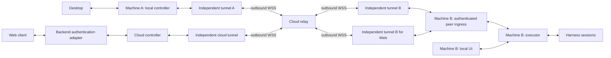

# RFC extension: Desktop and web control through a cloud relay

Status: Desktop cloud tunnel implementation and deployed real-harness acceptance complete; controller-only Web hosting remains future work.

Parent: [Independent harnesses, daemon supervision, and peer transports](rfc-rc-daemon-peer-transports.md).
Tracking: [CLI !188](https://git.xiaoaojianghu.fun:114/dev/agentgit/agent-git/-/merge_requests/188)
and [issue #44](https://git.xiaoaojianghu.fun:114/dev/agentgit/agent-git/-/work_items/44).

## Decision and scope

Desktop must control and converse with a machine that exposes no public inbound
RC listener. Both machines make outbound connections to a cloud relay. Desktop's
local controller remains the origin of its peer operations. Web conversations
originate from a cloud service using the same controller library. They share the
destination executor, session identities, authorization rules, and receipts.

The relay transports opaque peer traffic. It does not call session methods,
retry commands, supervise agents, or construct conversation history. The cloud
controller is an authenticated endpoint used by web clients; Desktop does not
need to pass its commands through that controller. Both services may share
infrastructure, but their dependencies, state, and failure domains are separate.

Every ordinary CLI installation includes controller and executor. A machine can
originate operations and accept authorized operations at the same time. Device
registration supplies a controller identity for outbound operations. Inbound
peer admission is a separate opt-in that starts the presence and ingress path;
it must not start a second executor for sessions already accessible through
local IPC or SSH.

## Topology and ownership

The arrows show bidirectional traffic. Every WSS socket is dialed toward the
relay, including the socket on the destination machine. The cloud-controller
route has its own destination tunnel worker; it shares the executor with the
Desktop route, not that route's transport process. The diagram omits unused
executor/controller modules on ordinary machines, not their installation.

| Component | State and responsibility |
| --- | --- |
| Desktop | Machine selection, rendering, persistent submission IDs, and local IPC attachment |
| Shared controller | Peer actors, authenticated requests, pending outcomes, subscriptions, deadlines, and reconnect policy |
| Daemon host and peer ingress | Device credentials, inbound peer authentication, connection supervision, and dispatch to controller or executor interfaces |
| Executor | Native ownership, session lifecycle, operation receipts, approvals, authoritative events, and local history |
| Tunnel worker | One transport attempt, bounded byte/frame I/O, transport acknowledgments, and failure reports |
| Cloud directory and authorization service | Device enrollment, device public keys, account/workspace grants, revocation, and relay discovery |
| Rendezvous broker and relay | Presence, pairing authorized endpoints, connection leases, quotas, and opaque data forwarding |
| Cloud projection adapter | Authorized event subscriptions and derived searchable/display history |

Connection supervision is outside the executor. Outgoing peer retries belong to
the controller; presence and inbound offer lifecycles belong to the daemon host.
Neither waits for network I/O while holding the executor's session coordinator.

## Enrollment and outbound connection establishment

Endpoint names below are proposed contracts. Existing `/rc/ws` and
`/ws/workspaces/{id}` remain legacy protocol endpoints during migration.

1. Install the ordinary CLI on the target and enable its daemon as a user
   service. Device registration generates a private device key locally and
   binds its public key and stable `machine_id` to an approved account or
   organization. The owner selects remotely accessible projects and
   capabilities. Registration never uploads the device private key or implies
   access to every local path. A controller may register without enabling
   inbound admission.
2. The target host supervises a presence tunnel that dials
   `wss://relay/.../peer/presence` over port 443. The broker authenticates the
   device, assigns a presence epoch, and publishes leased reachability. This
   socket carries transport offers and liveness, not session RPCs. An inactive
   machine needs only this connection; it need not run a harness.
3. Desktop signs in and selects the registered machine. Its local daemon
   registers its controller key on first outbound use when needed, then obtains
   a scoped caller grant and requests a link from the rendezvous API, such as
   `POST /peer/links`. The request identifies both peers and the security scope;
   it does not contain a session command. Desktop stores credential references,
   not raw bearer tokens in its machine configuration.
4. The broker checks membership, device status, scope, and capacity. It sends a
   link offer to the target's presence connection. The target host checks local
   remote-access policy and capacity before accepting. The broker issues a
   separate short-lived, single-use join ticket for each endpoint, bound to
   endpoint identity, link ID, role, relay region, and presence epoch.
5. Each daemon starts an independent data tunnel worker, which dials
   `wss://relay/.../peer/data` using its join ticket in protected headers. The
   relay pairs the sockets atomically and returns a transport-ready result only
   after both authorized endpoints have joined. An abandoned offer or half-link
   expires and releases its capacity. Reconnecting requires fresh tickets.
6. The daemons authenticate and encrypt their peer channel through that byte
   transport, then negotiate protocol version, capabilities, and daemon boot
   identity. Only after those checks may the controller report the peer ready.
   Relay acceptance, WebSocket readiness, and peer readiness are distinct states.
7. The controller reads the target's session catalog, attaches event cursors,
   and exposes authorized operations to Desktop. No public IP, inbound port,
   SSH server, or NAT hole punching is required on the target.

The same registration mechanism applies to either ordinary machine. To let B
initiate control of A, enable A's inbound peer service and grant that direction
explicitly. Being a target does not define a separate CLI edition, and an
outbound controller registration does not enable A's inbound service.

Each active peer route gets a separate data worker and bounded queue. Losing the
presence socket blocks new offers but does not automatically close healthy data
links. Revocation and credential expiry still apply to existing links. Losing a
data worker affects that route; it does not restart the daemon or its harnesses.
Presence and data workers attempt a connection once; the supervising host or
controller owns backoff and refreshes credentials before another attempt.

This requires outbound access to the authorization service and relay, with WSS
permitted by the network's proxy policy. It does not make an offline, sleeping,
or uninstalled machine remotely executable. Service startup and credential
renewal must work without an interactive terminal after initial enrollment.

## Peer identity, encryption, and authorization

Authorization has two independent gates. Cloud connection policy determines
which authenticated user/controller may reach which device. Executor resource
policy determines which sessions that user may discover, read, observe, or
mutate. Effective access is their intersection. A connection grant is not a
session grant, and cloud admission cannot override the executor's local ACL.

Use issuer-qualified account IDs as principals, not display names. The executor
persists owner-approved resource policy, with explicit session rules or project
rules inherited by its sessions. Unlisted principals have no session access.
Only a locally authorized owner may expand that policy. Cloud roles and scopes
are upper bounds on delegated access, not substitutes for a local decision.
Apply resource authorization to session catalogs, history, replay, approvals,
and every subscription event as well as mutations; denying writes alone still
leaks other sessions. Policy changes invalidate subscriptions and queued work.

Carry a transport-independent, non-serializable admission lease with executor
work. Recheck it when preparing a request, claiming its execution ticket, and
admitting a native launch. Ticket acceptance and policy invalidation must be
ordered by the same authority read lease, so revoked queued work cannot become
an accepted native operation. A reduced role cannot retain its former owner
privileges. Closing a cloud attachment invalidates its unaccepted work; an
operation already accepted keeps its receipt and must not be reported as never
executed. Revocation does not establish that an in-flight side effect was undone.

This delegated resource ACL applies to cloud peer ingress. Owner SSH retains
its existing host-owner authority for this implementation; adding per-user
session filtering to the SSH owner bridge is out of scope. SSH authentication
continues to protect that bridge. This exception does not bypass native write
ownership checks or permit two writers to a session. Do not translate a cloud
connection grant into SSH/local-owner authority.

Web RC, cloud controller, identity/directory services, connection authorization,
and rendezvous are control-plane components. The relay's socket pairing and
opaque forwarding are its data-plane component. Even if packaged together,
these components keep separate interfaces and state; data-plane admission
enforces the control plane's transport decision without minting session rights.

Transport admission and execution authorization are separate checks:

- A join ticket permits joining one relay link. It grants no session method.
- Device identity proves which daemon terminates the peer channel. Stable
  identity is independent of an SSH alias, relay address, IP, or process PID.
- A caller grant binds the authenticated user, origin controller key, target
  machine, any cloud-imposed scope/operation limits, expiry, and revocation
  epoch. The executor further restricts it using local resource policy. A web
  user cannot supply a role string that becomes machine-owner access.
- The target verifies the grant and local policy at operation admission and
  before a queued mutation reaches its effect boundary. Native ownership is a
  further check, not a consequence of authentication.

Use a reviewed TLS 1.3 implementation with mutual endpoint authentication over
the relay's ordered byte channel. The logical initiator is the TLS client and
the target is the TLS server even though both dial outbound WSS. Outer WSS
protects relay credentials; inner TLS terminates in daemon peer adapters. The
relay and tunnel workers need neither plaintext RPCs nor device private keys.
Do not add custom cryptography to the transport worker.

Enrollment establishes trust in device keys through owner approval or an
explicitly trusted organization directory. Controllers persist the approved
target key binding. Key rotation requires an authenticated rotation record or
renewed owner approval; an unannounced identity change fails closed. Existing
`machine.describe` fingerprint comparison over owner SSH is not a replacement
for cryptographic peer authentication on an untrusted relay. The authorization
issuer is trusted for delegated membership; a relay alone cannot mint grants.

Cloud controller keys are explicit endpoint identities with scoped delegation.
Desktop-to-machine traffic can remain opaque to the cloud relay. Web-to-machine
traffic is readable by the cloud controller because it is an endpoint. Cloud
history receives conversation contents only through separately authorized
subscriptions or history publication, never by interception in the relay.

Remote peer ingress must not pipe untrusted cloud bytes into the current
owner-authenticated Unix socket. Local OS credentials keep their owner semantics;
remote requests enter a distinct authenticated dispatch context. Incoming peer
requests can call permitted local executor methods. They cannot recursively use
`peer.request` to control a third machine unless a separate delegation explicitly
permits that action. A duplex link also grants no automatic reverse authority.

Grants are short-lived and renewable. Revocation updates invalidate cached
authority and control leases; if freshness cannot be established, cloud-origin
reads and writes stop when their authorization lease expires. Already running
turns are not retroactively undone. Independently authorized local or SSH access
continues according to its own policy, not the availability of cloud membership.

A Cloud attachment retains the verified grant deadline in request admission,
queued execution guards, and response/event projection. Deadline enforcement uses
both a monotonic timer and the verified expiry timestamp. Expiry closes that
attachment; the controller reconnects through Cloud admission to obtain a fresh
grant and route generation. This renews access without replaying mutations or
restarting the harness. A new attachment never revives work queued under an
expired grant. If Cloud admission is unavailable, the connection stays closed.

## Shared protocol and operation lifecycle

Put peer wire types and endpoint authentication in small shared packages without
harness, transcript, Git, or settlement imports. Keep worker IPC, peer protocol,
and harness protocol versions separate. Unknown mandatory capabilities reject
attachment; they must not silently downgrade to legacy owner access.

| Integration seam | Planned change |
| --- | --- |
| `peer.connect` host adapter | Accept a transport-tagged SSH or cloud route naming a stable target; preserve the existing owner-SSH input during migration |
| Controller connection factory | Resolve the route and obtain fresh grant/join credentials on every attempt; retain credential references rather than replaying a spent ticket from static headers |
| Tunnel provider | Reuse bounded WebSocket byte transport; keep enrollment, session methods, and operation retries outside the worker |
| Peer endpoint adapter | Authenticate both endpoints, negotiate capabilities, and produce a verified caller context for incoming executor dispatch |
| Daemon composition | Serve local IPC and authorized inbound peer connections together, sharing one executor and supervising each ingress independently |
| Desktop machine model | Add a cloud route with machine identity and credential references; continue using local IPC and the shared peer event envelope |

An accepted transport must be attachable to the peer endpoint adapter without
pretending the destination initiated a new outgoing controller operation. The
broker presence protocol belongs to the host connection service; only the
authenticated peer protocol reaches executor dispatch. These interfaces replace
the static SSH-only assumptions without putting cloud SDKs in harness adapters.

| Coordinate | Meaning |
| --- | --- |
| `machine_id`, `controller_id` | Stable destination and authenticated logical origin |
| `daemon_boot_id` | Executor instance used to detect restart and require reconciliation |
| `route_id`, `generation`, `link_id` | Chosen route, attachment generation, and relay attempt |
| `operation_id`, `request_id` | Stable logical operation and unique wire attempt |
| `session_id`, `session_generation` | Logical session and its current execution generation |
| `control_epoch`, `origin_epoch` | Session mutation authority and origin recovery fence |
| `stream_id`, `seq` | Replay identity and ordered event cursor |

A peer request carries these relevant coordinates, its immutable admission
expiry, method, payload, authenticated caller grant, and normalized payload
fingerprint. The destination derives the caller from verified credentials;
untrusted envelope fields cannot override it. Responses distinguish rejection,
acceptance, completion, and uncertain execution. A transport acknowledgment
means only transport progress.

For a submitted turn:

1. Desktop persists a submission ID before submitting through local IPC. The
   controller durably maps it to one operation ID, target, and payload digest
   before dispatch. A lost local IPC reply must not turn a repeated submission
   into a fresh operation. Web submission uses the same rule.
2. The controller authenticates the route, binds the expected session/control
   generation, and sends the request through the tunnel. It does not broadcast
   the same mutation on SSH and cloud simultaneously.
3. The executor checks scope, expiry, generations, session control, and native
   ownership, then records the operation before giving it to the harness. The
   deduplication key includes authenticated origin and target; a repeated key
   with different intent is rejected.
4. The executor records its outcome and emits sequenced events. The controller
   resolves the pending call and subscriptions without changing session identity.
5. If a response is lost, the controller queries the original operation outcome.
   Reconnection or UI resubmission must not create another turn. If the native
   runtime cannot prove whether it accepted the action, the outcome stays unknown.

There is no universal exactly-once promise across a native process crash. In
particular, terminal input and approval decisions cannot be replayed merely
because a transport timed out. Read-only calls can retry within their original
deadline. A mutation may only be retransmitted under a negotiated durable
deduplication contract with the same key and intent; otherwise recover its
outcome and require an explicit new user action after reconciliation.

Receipt retention must outlast the operation's admission window. Encode origin
epoch and creation time in the operation key and bind them to the intent;
renewing a grant cannot make that same key young again. After its immutable
admission expiry, an outcome query may return a retained receipt or `expired`,
but a submission may not execute, even if its receipt was compacted. Keep compact
deduplication records while the key could still be admissible. Persist accepted
and unknown operations across controller/executor restarts. Cancellation of a
wait is distinct from an executor-confirmed interruption of the native turn.

## One executor and session control gate

Local IPC, owner SSH, relayed Desktop, and cloud Web dispatch into the same
executor and native session registry. Refactor the current local-owner/Hub mode
choice into composed ingress adapters before enabling this on a user's existing
daemon. Do not run a parallel cloud daemon that independently resumes its sessions.

The executor distinguishes native write ownership from an Agit client's control
lease. If another native program owns the session, or ownership is unknown,
every Agit entry is read-only. Agit must not infer ownership from inactivity.
Adapters unable to establish native exclusivity expose observation only for
external sessions until a verifiable handoff exists.

For an executor-owned session, observers may coexist. A mutation requires one
executor-issued control lease bound to user, client, origin controller, session
generation, and control epoch. Opening a second window or connecting Web does
not preempt that lease. An explicit transfer is serialized by the executor and
invalidates queued requests from the old epoch. Losing a route or lease does
not terminate an accepted turn. Disconnecting the UI keeps peer supervision
alive but does not create an indefinite claim for an abandoned UI client.

Lease renewal has a bounded lifetime, independent of the transport connection.
After expiry the executor can grant another client control only while native
ownership remains verified; native ownership uncertainty still denies all writes.
Queued operations recheck the lease before execution. Commands already accepted
by the harness cannot be revoked by changing a lease and remain visible as
in-flight work to the next controller. Transport migration preserves the same
lease only after identity and current authority are revalidated.

This gate is independent of relay implementation. Retain focused checks and
diagnostics during integration; exhaustive native concurrency fault testing is
a separate workstream. Do not advertise write capability for an unverified
adapter while that work is incomplete.

## Desktop and Web behavior

Desktop selects a stable machine with a route configuration: local, SSH, or
cloud relay. An enrolled cloud machine needs no SSH host or remote executable
path in Desktop. Its daemon must already be installed and compatible. The UI
uses the same session list, conversation, approval, and terminal interfaces;
capabilities from the target determine which controls are available.

Display distinct states for offline, connecting, authentication required,
identity changed, ready, observing, and outcome unknown. An unknown operation
gets a status lookup rather than an automatic replacement submission. Closing
Desktop does not kill remote sessions; reopening reloads sessions and cursors.
Logging out revokes that client's cloud authority and subscriptions without
implicitly terminating accepted remote work.

SSH and cloud routes attach to the same machine identity and session registry.
Initially select the route explicitly. A later optional automatic policy may
prefer SSH and fall back to cloud for a fresh attachment or safe reads. It must
fence the old route, query outstanding mutation outcomes, and revalidate control
before sending new mutations. Changing a route does not create or resume a new
native session. Cloud outage must not break an existing independently authorized
SSH route or local execution.

Web authenticates through existing backend services into a controller-only host.
Use the same peer protocol and controller library as Desktop. Partition actors
and subscriptions by tenant/security scope, keep stable logical controller IDs,
and route requests to their current owner. Replicas use durable origin epochs
and fenced ownership recovery; stale replicas cannot renew authority or issue
new accepted mutations. A new owner recovers intent and queries receipts before
resuming dispatch. Backend HTTP routing must not retry a submitted mutation with
a new operation ID.

On takeover, revoke the old origin lease and obtain a higher signed origin epoch.
Each destination durably installs that fence and rejects lower epochs. A new
actor cannot mutate that destination until its fence is acknowledged or the old
authority has expired and fresh authority is verified. An unreachable target
stays unavailable. Database ownership alone is not a fence against an old process
that still has a live peer socket. Apply the same discipline to cutover adapters.

## Events, history, and cloud infrastructure

The destination owns sequenced session events. Reattach by session, generation,
and last confirmed sequence; subscribers deduplicate replayed events. A bounded
replay gap produces an explicit gap plus a state/history resynchronization, not
a claim that missing transient terminal output was recovered. A daemon restart
changes boot identity and requires session reconciliation before mutations resume.

The projection adapter is an authorized subscriber, possibly through its own
cloud controller attachment. It stores derived history with idempotent event
keys and can recover independently of Desktop. Merely choosing cloud transport
does not authorize history upload. Projection lag or storage failure must not
hold the executor's coordination lock or block session RPC responses.

The directory records durable device identity and home relay region. Presence
records are leased and fenced by epoch; they are a discovery hint, not proof of
peer readiness or write permission. Route both ends of a link to the same relay
owner. A multi-replica relay may redirect clients or proxy opaque bytes to that
owner; it does not store session RPCs in the legacy command bus.

Start with one configured home region. A relay process restart loses its links;
controllers reconnect and reconcile through the same peer contract. Regional
failover may be added by fencing directory ownership and issuing fresh link
tickets. Do not transparently move a live connection or replay buffered commands
across regions. Existing Redis/database infrastructure can hold directory,
presence, grants, and projection state; session request correlation belongs to
controllers and acceptance receipts belong to executors.

## Fault isolation, limits, and diagnostics

| Failure | Required behavior |
| --- | --- |
| Target offline or asleep | Show unavailable; no cloud command queue that runs mutations on an eventual wake-up |
| Presence channel lost | Retry presence; existing authorized data links remain independent |
| One data worker crashes or stalls | Replace that route, preserve sessions, advance generation, recover outcomes |
| Relay or network fails | Both ends reconnect; no harness restart and no blind mutation replay |
| Controller restarts or ownership moves | Recover stable intent and origin authority, fence the old actor, query receipts |
| Executor or harness restarts | Reconcile native state and receipt outcomes before offering write access |
| Grant revoked or expires | Deny further unauthorized access; do not treat disconnection as successful cancellation |
| Slow observer or full projection queue | Isolate its queue, report lag/gap, leave other routes responsive |
| Identity or required protocol changes | Reject attachment with an actionable reason; no owner-mode fallback |

Bound pending offers, peers, RPCs, frame bytes, queued bytes, and events per
stream, peer, device, and tenant. Use fair draining and an aggregate daemon/relay
budget. Reject excess admission explicitly; do not let one large terminal stream
consume every route's queue. A data-link queue is transient transport buffering,
not an offline mutation inbox. Timeouts and retries never extend an operation's
original admission deadline. Backoff has a cap and jitter.

Initial protocol defaults are proposed policy values, not measured capacity:

| Policy | Initial value and constraint |
| --- | --- |
| Join ticket / half-link | Expire after 30 seconds / close an unmatched data socket after 15 seconds |
| Presence | Heartbeat every 20 seconds; expire after 60 seconds without renewal |
| Cloud grant | Valid for at most 120 seconds; renew by 60 seconds; reject clock skew beyond 30 seconds |
| Agit client control lease | Valid for 30 seconds; renew every 10 seconds while the client is attached |
| Mutation admission age | At most 5 minutes from the time encoded in its operation key; use a shorter caller deadline when supplied |
| Receipt retention | Keep final outcomes for 7 days; compact only after admission is impossible; retain accepted/unknown records until reconciled or explicitly retired |

Revocation push closes authority sooner; loss of that push never extends grant
validity. Clock uncertainty denies new mutations. Controller renewal cannot keep
an absent UI client's control lease alive. Reaching a cap on unresolved receipts
rejects new admissions rather than discarding uncertainty. Bound frames and
per-peer queues by the existing worker/controller limits or lower negotiated
limits, and add aggregate device/tenant limits before enabling the relay. Replay
retention remains configurable because an explicit gap is part of the contract.
Keep these policies versioned in shared configuration and test their boundaries;
do not scatter them through harness adapters.

Daemon logs correlate user/action metadata, operation and request IDs, device,
boot, route and generation, control epoch, worker PID, outcome, and stream gaps.
Broker/relay logs correlate link ID, endpoint IDs, ticket identifier digest,
region, lifecycle, byte counts, and transport failure category. Relay logs do not
need operation IDs from the encrypted payload. Endpoint logs join an operation
to its link ID for cross-service diagnosis. Redact grants, tickets, private keys,
prompts, and transcript content. Store structured rotating logs with bounded
queues; preserve drop counters. Durable operation receipts remain separate from
best-effort diagnostics.

## Current baseline and delivery sequence

The implementation has independent presence/data tunnel workers, a separately
buildable controller, device enrollment/discovery, cloud rendezvous, and mutually
authenticated cloud peer ingress into the existing executor. Desktop supports
local, SSH, and cloud routes; its cloud operations originate in its local
controller. The cloud relay forwards encrypted peer records and never dispatches
session methods. Legacy Hub registration, request routing, and projection remain
compatibility paths; they do not define this architecture.

The process integration fixture covers an actual HTTP/WebSocket backend, daemon
pair, OS tunnel workers, native Desktop IPC, and a synthetic harness subprocess.
It validates conversation receipts, events/history, worker recovery, and executor
session denial. The deployed dev relay also passed real Codex acceptance on
chiikawa, including a Desktop-originated turn and worker reconnection. See the
[implementation evidence](rc-peer-implementation.md#deployed-cloud-acceptance-on-2026-09-15).
The controller-only Web host and its projection/cutover are later milestones.

Sources: [peer adapter](../src/rc/peers.rs),
[tunnel adapter](../src/rc/tunnel.rs),
[daemon composition](../src/rc/daemon/pump.rs), and
[implementation progress](rc-peer-implementation.md).

Deliver small changes on the existing RFC/implementation review line:

1. Shared peer schema, authenticated identity/grant context, outcome lookup,
   and ingress composition into one existing daemon/executor. Preserve owner
   SSH compatibility while keeping its authority distinct.
2. Enrollment/discovery, presence and rendezvous, then independent cloud data
   workers and an opaque relay. Prove outbound-only machine-to-machine control
   with a protocol fixture and an isolated real daemon pair.
3. Desktop cloud machine selection through the local controller. Verify remote
   conversation and controls, event replay, disconnect recovery, and trace logs.
   This is a complete product milestone without a cloud controller dependency.
4. Controller-only cloud host with backend authentication, scoped subscriptions,
   durable origin recovery, and projection adapters. Move Web control to it using
   the same relay and remote executor; verify shared-session behavior with Desktop.
5. Publish and verify Windows/Linux peer startup artifacts before retiring the paired
   CLI, Hub, and Web paths. Keep Linux 0.2.0 peer/Cloud communication supported; its
   old default startup requires an upgrade. Workspaces without a peer device display
   No device. Never fall back to paired execution or resubmit historical pending work.

Cloud changes use the companion backend and deployment MRs; Desktop changes use
the companion Desktop MR. Deploy the backend with the relay disabled before
activating the dev runtime flag, then run the deployed acceptance runner. Avoid
building another conversation-aware relay as an intermediate architecture.

## Acceptance evidence required for implementation

| Requirement | Evidence |
| --- | --- |
| Target needs no public inbound RC access | No public RC listener; connection trace shows target and Desktop dialing outbound WSS; session list and conversation succeed. SSH may prepare and inspect the fixture but carries no test session RPCs |
| Complete authorized control path | Start, resume, turn, interrupt, approval, permitted terminal operations, and event replay against supported harnesses; denied capabilities remain disabled |
| One executor across entry points | Local, SSH, Desktop relay, and Web show the same machine/session IDs and executor PID; no duplicate native launch |
| Shared controller and lightweight cloud | Standalone builds and dependency inspection; cloud startup performs no executor, native transcript, or Git initialization |
| Relay is transport-only | End-to-end authentication fixture rejects impersonation; relay inspection sees encrypted records and lifecycle metadata, no session dispatch/projection |
| Scoped access and revocation | Wrong tenant/device/project, expired ticket/grant, stale epoch, and changed key reject; valid observation/control works within scope |
| Independent resource authorization | A user admitted to the device cannot list, read, subscribe to, or mutate a session absent from its executor ACL; removing access closes subscriptions |
| Recovery avoids duplicate effects | Kill worker or drop reply after acceptance; query the same operation and observe no second turn; late unknown outcome remains explicit |
| Session control policy | External or unknown native ownership is read-only; a second Agit client observes until a valid transfer; log the rejection and control epoch |
| Isolation and diagnosis | One stalled peer/observer leaves another usable; traces join Desktop/controller, relay link, executor, and harness outcome without body/token leakage |
| Migration preserves authority | Legacy/new cutover and rollback reconcile outstanding work and fence the previous adapter; incompatible peers report unsupported capability |

Prioritize these end-to-end integration checks and retained logs. A green
transport fixture does not prove every native ownership race; document adapter
limits and keep unsupported external control read-only while extending coverage.
