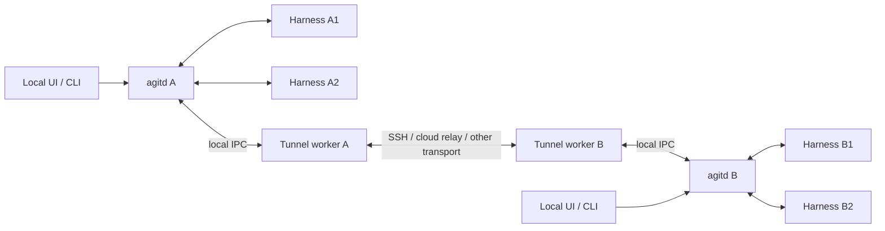

# RFC: Independent harnesses, daemon supervision, and peer transports

Status: Implementation in progress. Review and implementation ownership are tracked in the linked issue.

Tracking issue: [agent-git #44](https://git.xiaoaojianghu.fun:114/dev/agentgit/agent-git/-/work_items/44).

RFC and implementation MR: [CLI !188](https://git.xiaoaojianghu.fun:114/dev/agentgit/agent-git/-/merge_requests/188).

Desktop companion: [Desktop !3](https://git.xiaoaojianghu.fun:114/dev/agentgit/agent-git-desktop/-/merge_requests/3).

## Decision requested

Adopt three independent components for remote control: agent harness sessions,
the local `agitd` supervisor, and replaceable tunnel workers. Each machine's
daemon manages its own harness sessions. Daemons communicate over tunnels to
control sessions on other machines. Transport failures and individual session
failures must leave the daemon responsive and unrelated sessions usable.

The selected direction includes a cloud-hosted `agitd` for web conversations.
Desktop and web clients connect to their respective entry daemons, which reuse
the same peer-control implementation. Deliver this architecture in stages;
do not build a new relay-intercepting conversation gateway as an intermediate
architecture.

Desktop must also reach machines without public inbound access through a cloud
relay. Its local controller originates those operations; the cloud controller
originates web operations. Both use the same peer contract and destination
executor. The [cloud relay design extension](rfc-rc-cloud-relay.md) specifies
outbound rendezvous, endpoint authentication, delegated grants, recovery,
Desktop behavior, and the delivery/acceptance plan. Desktop cloud access passed
deployed real-harness acceptance; controller-only Web hosting remains future work.
See [implementation evidence](rc-peer-implementation.md#deployed-cloud-acceptance-on-2026-09-15).

The audited revisions partially satisfy this design. They have subprocess
harnesses, multiple supervised sessions, reconnect logic, and several useful
isolation mechanisms. The audit findings below refer to those revisions.
[Implementation progress](rc-peer-implementation.md) tracks the independent
controller/tunnel components, Desktop migration, and executor launch workers
added on this MR. Synchronous admission work and external native ownership
remain incomplete.

This RFC records the target architecture and acceptance criteria. The implementation
branch is incremental; unchecked criteria are not claims about deployed behavior.

The cloud RC behavior inherited from !182 and !189 is implementation history and
temporary compatibility code, not an accepted target architecture. Their merge
preserves existing work and review records. The target replaces cloud control
with the shared `agitd` controller; the existing Hub gateway, registration flow,
and reconnect implementation do not constrain that design.

## Internal composition and installation

The ordinary Agit CLI installs both controller and executor capabilities. There
are no separate desktop-machine and execution-machine editions. `agitd` composes
these modules through explicit interfaces and independent state ownership:

| Component | Owns | Must not depend on |
| --- | --- | --- |
| Controller | Peer connections, request correlation, subscriptions, discovery, deadlines, reconnect policy, and operation outcomes | Harness adapters, native history, repository settlement, or executor state |
| Executor | Local session supervision, harness lifecycle, exclusive session control, approvals, history, and settlement | SSH commands, UI connections, or controller request maps |
| Tunnel | Connection establishment, framed packet transport, write acknowledgments, and transport status | Session methods, caller authorization, operation retries, or executor state |
| Host composition | Local owner authentication and wiring controller/executor APIs into a service | Application logic duplicated from either module |

The controller is an independently buildable library. A cloud service can compose
it with existing backend authentication and storage without compiling or starting
an executor. This is a dependency boundary; a runtime flag that leaves every
harness and repository dependency linked into the cloud process does not meet it.

Controller and tunnel components must build and test independently. They share
only transport-neutral protocol types and small infrastructure contracts with
the executor. Session registry state, native adapters, local transcript storage,
Git workspaces, and settlement belong to the executor and cannot enter the
controller through a convenience import or a shared service singleton. The host
composition wires these interfaces together and owns component startup and
shutdown; it does not merge their request maps or retry loops.

| Deployment | Composition |
| --- | --- |
| Standard CLI on any machine | Controller + executor, with independent tunnel workers |
| Cloud entry service for web RC | Controller + backend authentication/projection adapters, with independent tunnel workers |

The cloud entry service does not construct or initialize an executor. Supporting
cloud execution later requires explicitly composing an executor there; remote
web conversations alone must not pull in harness discovery, native transcript
access, Git workspace initialization, or settlement. Ordinary CLI installations
keep both roles available without separate desktop and execution editions.

The SSH provider receives an executable argument vector from the host composition
layer. The tunnel does not know that the remote command opens an Agit bridge.
WebSocket transport extraction likewise leaves registration, replay, and authority
negotiation in the existing Hub protocol adapter.

## Concurrency and external session control

The destination executor is the only authority for a native session's write
ownership. Local clients, peer controllers, and the legacy Hub path must pass the
same mutation gate. A tunnel connection, machine-owner login, or writable UI does
not constitute possession of a native session's control channel.

An externally controlled session retains read access through every Agit entry point.
Reading history, observing status, and subscribing to events remain available.
Starting or steering a turn, interrupting it, deciding an approval, changing the
model or permission mode, running a mutating runtime command,
and resuming a second writer must fail before changing the native session.

Ownership has three distinct states: held by this executor, held externally, and
unknown. External and unknown ownership both deny writer-dependent mutations.
An independently verified native inbox is a narrow exception: authorized operators
may queue text for the exact native session without acquiring its writer. Queue
acceptance confirms persisted delivery, not execution or live control. Receipts
remain scoped to caller, workspace and native identity across reconnects, and the
existing dangerous-session restriction still applies. No controller or tunnel may
emulate this capability with another resume or direct transcript writes.
Transcript activity
is useful for display but silence, elapsed time, a disconnected UI, and a missing
PID file are not proof that another program released control. A handoff requires
positive release/acquisition evidence from the runtime or a cooperating exclusive
writer protocol. A runtime that cannot provide that evidence denies writer-dependent control
for external sessions; the controller must not implement an automatic takeover.

The write permit identifies the native runtime/session and its current generation,
not a workspace path or a network socket. Reserve, execute, and publish must check
the same generation. Losing ownership invalidates queued writes and approval
responses; reconnecting never resurrects the previous permit. Permissions to
read historical data remain independent of possession of the write permit.

Concurrent requests to different sessions must progress independently. A request
timeout removes its own correlation entry and reports its outcome; it does not
tear down a healthy peer or invalidate unrelated session operations. A queued
request that expires before writing is cancelled as `not_sent`. Once a write
begins, a missing response is `unknown`; transport acknowledgment alone is never
an execution receipt. Reconnection may retry a bounded set of read-only queries,
but must not replay mutations without a durable executor deduplication receipt.

The audited code has per-session RPC gates and read-only watch streams, but its
resume guard uses transcript recency. That heuristic does not establish exclusive
ownership. Replacing it is required before claiming strict external-writer
isolation; controller/tunnel extraction alone does not satisfy this requirement.

## Audit scope and reproducibility

The audit on 2026-09-15 inspected:

- CLI checkout `/Users/wst/agent-git`, branch `codex/desktop-planning`, HEAD
  `af85e98f65149e40a4e58d2d023e53fa93593b7b`, including existing uncommitted RC
  and local-owner additions. Those additions belong to the existing workspace;
  this audit does not commit or modify them.
- CLI GitLab `main` at `5c5c56543950537b2cd0ac4be052978027b7db34`, fetched and
  inspected separately without changing the checkout. Core findings below also
  apply to this revision. Its watch/discovery improvements do not introduce
  daemon peers or move start/resume out of the global dispatch path.
- Backend checkout `/Users/wst/AgentGit-backend`, clean `main` at
  `248f9e3cbd2027cf63826bce88b118fc98966d7f`. Remote `main` was also checked at
  `ee6fa621c4a6343102c1665f8efce74842224327`; there is no diff between those
  revisions in `src/features/rc/` or `src/infra/rc_route_proxy.rs`.
- Desktop checkout `/Users/wst/agent-git-desktop`, clean at
  `f569cde8be493f04e2e503af6272ebbd9ef2679f`, inspected to confirm who actually
  starts SSH and owns the remote request map.

The immutable source links below use the inspected remote revisions. References
to `src/rc/local.rs` describe an uncommitted local addition, not a released or
merged capability. No daemon was restarted, session launched, or configuration
changed as part of this audit.

## Conformance to the requested design

| Requirement | Assessment | Evidence |
| --- | --- | --- |
| Harness, daemon, and tunnel are independent components | Partial | Harnesses are child processes. Hub `Link` and socket establishment run inside `agitd`; no separate cloud tunnel worker exists. |
| One daemon manages multiple local sessions; a failed session or tunnel cannot disable it | Partial | Per-session tasks and queued RPC isolation exist. Start/resume still await launch through global dispatch; transport/session task termination is not uniformly supervised. |
| A tunnel only transports daemon messages and supports SSH, cloud relay, or other implementations | Not satisfied as a common contract | WSS `Link` is Hub-specific. HTTP CONNECT is proxy establishment for that WSS link. The local SSH byte bridge is useful but is a separate owner-RPC mode, not a common peer transport. |
| Daemons mutually control sessions on different machines | Not implemented in the audited CLI/backend paths | The production path is viewer → Hub → one daemon. The machine ingress handles registration, heartbeat, responses, and events, not addressed peer control requests. |

### What already works and should be preserved

- `Daemon.sessions` stores multiple `Live` sessions. Each has a command sender,
  generation, and task handle. `spawn_session` launches a native harness and
  then starts `Session::run` in its own Tokio task.
- Harness subprocess plumbing owns process trees, drains stderr, and bounds
  output. Ordinary EOF and exit flow through session cleanup and an `Ended`
  note rather than intentionally stopping the daemon.
- Turn/interrupt/approval and permission operations use prepare/execute/project
  handling with per-session gates. Waiting on one admitted session RPC does not
  retain the global daemon lock.
- The Hub link reconnects with bounded backoff. Event delivery, registration,
  socket epochs, priority response queues, and replay have explicit handling.
- Local workspace/path checks and danger/approval barriers remain essential.
  Transport extraction must preserve them.

Sources: [session launch and task ownership](https://git.xiaoaojianghu.fun:114/dev/agentgit/agent-git/-/blob/5c5c56543950537b2cd0ac4be052978027b7db34/src/rc/daemon/sessions.rs#L998),
[harness process plumbing](https://git.xiaoaojianghu.fun:114/dev/agentgit/agent-git/-/blob/5c5c56543950537b2cd0ac4be052978027b7db34/src/rc/harness/proc.rs),
[session supervisor](https://git.xiaoaojianghu.fun:114/dev/agentgit/agent-git/-/blob/5c5c56543950537b2cd0ac4be052978027b7db34/src/rc/supervisor/mod.rs),
[outbound lanes](https://git.xiaoaojianghu.fun:114/dev/agentgit/agent-git/-/blob/5c5c56543950537b2cd0ac4be052978027b7db34/src/rc/outbound.rs).

### Gap 1: Transport and Hub semantics are embedded in the daemon

`Daemon::run` constructs `Link::new(hub, token)` inside a Tokio task in the same
process. `Link` establishes WSS, sends `rc.register`, handles negotiated features
and heartbeat, and delivers Hub frames back into the daemon. `Options` contains
a single Hub/token/connection configuration; there is no peer registry or
provider-neutral connection interface.

`transport::establish_tunnel` implements HTTP CONNECT to reach the configured
Hub WebSocket. Its name does not establish an independent daemon-to-daemon
tunnel abstraction. SSH forwarding that socket would still retain the Hub
protocol and Hub dependency.

Sources: [embedded reconnect task](https://git.xiaoaojianghu.fun:114/dev/agentgit/agent-git/-/blob/5c5c56543950537b2cd0ac4be052978027b7db34/src/rc/daemon/pump.rs#L188),
[Hub-specific Link](https://git.xiaoaojianghu.fun:114/dev/agentgit/agent-git/-/blob/5c5c56543950537b2cd0ac4be052978027b7db34/src/rc/link.rs#L192),
[socket establishment](https://git.xiaoaojianghu.fun:114/dev/agentgit/agent-git/-/blob/5c5c56543950537b2cd0ac4be052978027b7db34/src/rc/transport.rs).

### Gap 2: Failure isolation is incomplete

The main loop's fallback arm holds `d.lock().await` across
`on_link_event(...).await`. That calls `on_frame`, which awaits `dispatch`.
`session.start` and `session.resume` are not queued session RPCs: dispatch
awaits `start_session`/`resume_session`, and ultimately `Session::launch` and
`AnyDriver::launch`. Harness initialization writes use `Proc::write_line`,
which has no deadline of its own. Filesystem operations also occur inside
global dispatch, including synchronous directory reads.

If a launch write or filesystem operation stalls, the coordinator cannot
process unrelated frames or session notes while it waits. The reconnect task
also needs this mutex to update online state and prepare registration. This is
a responsiveness/isolation defect; it is not evidence that an ordinary child
exit necessarily crashes the daemon. The existing unanswered-RPC test exercises
interrupt handling, not the start/resume path.

`Live.task` is retained for shutdown, and normal cleanup depends on
`Session::run` reaching its `Ended` notification. The main loop does not
continuously join session tasks or the link task to classify an unexpected
panic/termination and reconcile or restart the affected worker. A Tokio task
boundary alone is therefore not a complete supervision policy.

Sources: [lock held across fallback dispatch](https://git.xiaoaojianghu.fun:114/dev/agentgit/agent-git/-/blob/5c5c56543950537b2cd0ac4be052978027b7db34/src/rc/daemon/pump.rs#L582),
[start/resume dispatch](https://git.xiaoaojianghu.fun:114/dev/agentgit/agent-git/-/blob/5c5c56543950537b2cd0ac4be052978027b7db34/src/rc/daemon/dispatch.rs#L323),
[queued RPC classification](https://git.xiaoaojianghu.fun:114/dev/agentgit/agent-git/-/blob/5c5c56543950537b2cd0ac4be052978027b7db34/src/rc/daemon/mod.rs#L1571),
[native write](https://git.xiaoaojianghu.fun:114/dev/agentgit/agent-git/-/blob/5c5c56543950537b2cd0ac4be052978027b7db34/src/rc/harness/proc.rs#L903).

### Gap 3: The local-owner bridge does not establish daemon peers

In the working tree, `agit rc local bridge --ensure` connects stdin/stdout to a
local Unix RPC socket, with a detached local daemon when necessary. This is a
useful transport primitive and lets an SSH channel disappear without owning
the daemon's lifetime.

However, `Daemon::run` selects either `local_owner` serving or the Hub link.
The local listener supplies an owner claim from OS peer credentials, rejects
Hub workspace targets and caller metadata, and has no remote daemon addressing
or peer authentication protocol. A client sending commands over SSH is not
itself a daemon-to-daemon control plane.

The local serving task logs an error and exits without a restart loop.
`listener.accept()` errors propagate out of the server. Fanout also awaits
each client's bounded send serially, so a slow client can delay other clients
until its timeout. These are working-tree findings in
`src/rc/daemon/pump.rs:204-215` and `src/rc/local.rs:208-237,320-341,441-455`.

### Gap 4: The backend is a viewer control plane, not a peer relay

`relay_from_viewer` checks current workspace roles, stamps caller identity,
prepares start idempotency/lineage or resume lineage, audits the command, and
routes it to the workspace's `connection_id`. Machine ingress registers the
daemon, correlates responses, persists session identity, and publishes events.
It does not forward a daemon-originated session command to another daemon.

The backend does contain regional HTTP/WebSocket forwarding and cross-Pod
command routing. Those connect Hub infrastructure to the selected machine's
socket; they do not add daemon peer addressing or a daemon-originated control
path. Cloud account authorization and workspace projection are real existing
responsibilities, so turning the whole backend into an opaque byte pipe would
remove required behavior. Separate a cloud relay data path from those services.

Sources: [viewer relay](https://git.xiaoaojianghu.fun:114/dev/agentgit/AgentGit-backend/-/blob/ee6fa621c4a6343102c1665f8efce74842224327/src/features/rc/routes.rs#L4257),
[machine ingress](https://git.xiaoaojianghu.fun:114/dev/agentgit/AgentGit-backend/-/blob/ee6fa621c4a6343102c1665f8efce74842224327/src/features/rc/routes.rs#L944),
[registry and correlation](https://git.xiaoaojianghu.fun:114/dev/agentgit/AgentGit-backend/-/blob/ee6fa621c4a6343102c1665f8efce74842224327/src/features/rc/registry.rs),
[regional routing contract](https://git.xiaoaojianghu.fun:114/dev/agentgit/AgentGit-backend/-/blob/ee6fa621c4a6343102c1665f8efce74842224327/docs/rc-region-routing.md).

## Proposed architecture

### Smallest useful change: move connection ownership into the local daemon

The current desktop path is concrete:

```text
Desktop Connection::connect
  → local ssh process
  → remote agit rc local bridge --ensure
  → remote Unix owner-RPC socket
  → remote agitd
  → remote harness
```

Desktop's `src-tauri/src/transport.rs:110-267` starts SSH, owns its pipes and
pending request map, and reports replies/events directly to the application.
`src-tauri/src/lib.rs:99-147` dispatches a desktop RPC through that connection.
No local `agitd` forwards these remote requests.

Sources: [desktop SSH connection](https://git.xiaoaojianghu.fun:114/dev/agentgit/agent-git-desktop/-/blob/f569cde8be493f04e2e503af6272ebbd9ef2679f/src-tauri/src/transport.rs#L110),
[desktop RPC entry](https://git.xiaoaojianghu.fun:114/dev/agentgit/agent-git-desktop/-/blob/f569cde8be493f04e2e503af6272ebbd9ef2679f/src-tauri/src/lib.rs#L99).

For owner-operated SSH, changing this entry is a bounded refactor rather than a
new remote execution system:

```text
Desktop → local agitd → independent SSH tunnel worker
  → existing remote bridge → remote agitd → existing remote harness
```

Reuse the remote bridge, existing JSON-RPC methods, `machine.describe`, native
harness adapters, and session receipts. Move remote connection configuration,
pending request correlation, event subscriptions, and reconnect decisions from
the desktop into the local daemon's peer/connection manager. The tunnel worker
retains only transport I/O and lifecycle reporting. The desktop becomes a
client of its local daemon and can close without tearing down the peer link.
Each daemon can establish an outgoing SSH connection to the other for mutual
control; a new symmetric network protocol is not a prerequisite for this step.

The first phase must still namespace request/stream IDs by remote machine,
separate local-session dispatch from remote forwarding, and retain unknown
outcomes across client disconnection. Otherwise moving `Command::new("ssh")`
alone leaves the actual ownership and retry logic in the application. Keep
owner-only authorization explicit in this phase. General delegated users,
provider switching, and a cloud peer relay are subsequent extensions, not
prerequisites for demonstrating the corrected SSH topology.

### Complete target



Both daemons can originate and receive commands. A tunnel connection carries
the same peer protocol regardless of which side initiated the network socket.
Connecting a new tunnel does not create another owner for a running session.

### Cloud conversations: use a cloud-hosted daemon directly

Desktop's cloud-relayed path is distinct from the web entry path:

```text
Desktop → local agitd controller → tunnel A → opaque cloud relay
  → tunnel B → remote agitd peer ingress → the existing executor → harness
```

Both tunnel workers dial outbound WSS to the relay. The target keeps a separate
outbound presence channel for rendezvous and accepts peer data through an
authenticated ingress adapter in its existing daemon. Local, SSH, and cloud
ingress share that executor. Cloud bytes must never inherit the authority of
the local owner socket. Desktop does not require a cloud controller to use the
relay; the cloud controller is another authenticated peer endpoint for web use.
See the [complete cloud relay design](rfc-rc-cloud-relay.md) for lifecycle and
authorization contracts.

The web control path is:

```text
Web client → existing backend authentication → cloud agitd (controller)
  → independent tunnel → machine agitd (controller + executor) → harness
```

The cloud daemon reuses the controller library used by the ordinary CLI. Its
build excludes the executor, rather than loading executor dependencies behind
a runtime switch. Conversation execution remains on the machine that owns the
session. Adding cloud execution is a separate composition change and is not
required for web access to an existing remote session.

Reuse the existing account, workspace, grant, history, and projection services.
The web-facing backend authenticates the user and passes a verifiable caller
context to the cloud daemon. The cloud daemon owns peer routing, pending
requests, subscriptions, and retry decisions using the same implementation as
the desktop's local daemon. The destination daemon remains responsible for
execution authorization and the authoritative session outcome. A cloud entry
daemon does not confer owner access to every authenticated web user.

The cloud relay transports peer traffic independently of the cloud daemon.
Conversation projection consumes authorized events from the daemon rather than
depending on passive interception inside the tunnel. If the peer channel is
encrypted end to end, the cloud daemon is an explicitly authenticated endpoint;
the relay does not need to decrypt conversation content.

Choose this design directly rather than first adding a new web conversation
gateway that intercepts relay traffic and independently implements control.
Both could support cloud conversations, but the intermediate gateway would
duplicate request correlation, routing, retry, and permission integration that
would then have to move into `agitd`. Reusing the daemon implementation gives
desktop and cloud the same control semantics and fault-handling tests.

Keep the existing viewer gateway temporarily for compatibility and rollback.
All new control behavior belongs in the daemon path. Preserving an existing
path during validation is not a separate architecture to build or extend.

### Traceability and execution ownership

Trace a user operation through:

```text
Initiating user → entry agitd → tunnel → execution agitd → harness
```

Carry one stable operation ID and authenticated initiating-user identity across
the daemon hops and retries. Correlate per-connection request IDs and transport
attempts with that operation; also retain the target machine, logical session,
and expected generation. An entry-daemon restart must not silently mint a new
operation key for an accepted request whose result is still unknown.

The entry daemon records intent, routing, and the observed result. The execution
daemon records acceptance, execution, and the authoritative result in its
receipt ledger. Tunnel workers record connection and delivery metadata, not
session decisions. A transport delivery acknowledgment is not proof of harness
execution. Audit records distinguish forwarded, accepted, completed, rejected,
and unknown outcomes without logging credentials or requiring prompt contents.

Cloud instances must recover the existing origin identity and pending receipts
before resuming control. Route each connection's request state to its owning
daemon instance, with fenced recovery when ownership moves; a replacement
instance must not duplicate an operation still owned by another instance.

### Component responsibilities

| Component | Owns | Does not own |
| --- | --- | --- |
| Agent harness session | Native execution, native protocol, native transcript | Cross-machine routing or tunnel lifecycle |
| `agitd` | Local session identity and registry, authorization, supervision, scheduling, request receipts, peer routing, recovery decisions | SSH/WSS implementation or waiting on child I/O inside its state coordinator |
| Tunnel worker | Establishing a byte/message channel, framing limits, network I/O, reporting connection state | Session creation, workspace lineage, permission decisions, or replaying side effects |
| Cloud `agitd` | Web-originated peer control using the shared controller; local execution only through an explicitly added executor | A second web-specific implementation of remote session control or implicit executor dependencies |
| Cloud backend services | Account/workspace control plane, routing rendezvous, optional relay, history/projection | Native harness supervision or duplicating daemon request/retry state |

A tunnel worker is an independently restartable process, including the cloud
provider. The executable may be distributed with `agit`; a separate package is
not required. Harness adapters may remain internal modules if their panics,
I/O waits, and resource use are contained. Otherwise isolate adapter execution
in a worker process too. The supervisor decides recovery; workers report facts.

### Contracts

1. **Local IPC and transport provider contract.** Define versioned worker
   startup/configuration and `connected`, `disconnected`, `failed`, and
   `stopped` lifecycle events. Use bounded framing over a Unix socket, named
   pipe, or stdio. The daemon schedules retry/backoff; the provider performs
   one connection attempt and reports the result. Implement SSH and cloud
   providers against this contract, without provider branches in session code.
2. **Peer identity and addressing.** Introduce a stable machine ID, daemon
   instance/boot ID, connection generation, and a peer registry supporting
   multiple concurrent peers/transports. Requests name the destination machine
   and local logical session. Daemon instance IDs fence delayed responses;
   native runtime UUIDs never replace logical session identities.
3. **Authentication and authorization.** Authenticate the peer and initiating
   user; bind both to the request. SSH account access must not automatically
   turn every relayed user into the target's owner. The destination daemon
   checks capability scope, workspace/path access, approval requirements, and
   current revocation state. Tunnel-supplied role strings are not authority.
   Cloud membership services can supply verifiable delegated grants while the
   destination remains the execution gate. Authenticate the end-to-end peer
   channel so the relay cannot silently become the initiating daemon.
4. **Protocol envelope.** Negotiate peer protocol/capabilities separately from
   transport connectivity. Carry source/destination identity, request ID,
   operation idempotency key, deadline, expected session generation, caller
   authorization, method, and payload. Events carry stream identity, generation,
   and sequence. Define request cancellation, outcome lookup, subscribe/replay,
   and explicit replay-gap behavior. Put shared wire types in a small package
   or shared schema with compatibility fixtures for CLI and backend.
5. **Session execution.** Reserve intent and generation under a short state
   transition; launch or communicate outside the coordinator; commit the result
   under the same generation fence. Cover start, resume, discovery, filesystem
   access, and cleanup as well as turn RPCs. Bound blocking workers and queues;
   timing out a blocking task must not falsely imply its operation stopped.
6. **Transport-independent local state.** A disconnected transport changes peer
   reachability, not ownership of local sessions. Keep local history capture
   independent from cloud availability. Publish history and refresh cloud
   grants through separate retryable work, preserving revocation constraints.
   Existing Hub socket feature leases must not become global authority for
   unrelated SSH peers or local-owner sessions.

### Failure and retry semantics

| Failure | Required behavior |
| --- | --- |
| Harness exits or adapter fails | Mark only that session/generation failed; reap its process tree; preserve transcript and receipts. Reconcile before offering resume. |
| Harness blocks stdin/stdout or launch | Deadline and isolate its worker; keep unrelated sessions and daemon status responsive. |
| Tunnel crashes, stalls, or sends malformed frames | Disconnect/restart only that worker, retain peer operation state, and keep local sessions running. |
| Slow peer or event flood | Per-session/per-peer byte budgets and fair draining; isolate the offending stream. Never make every client wait serially on one slow client. |
| Response lost after command acceptance | Return/query an unknown or pending outcome; retry with the same key and return the original result. Do not blindly run the command again. |
| Link changes from SSH to cloud | Authenticate the same peer and recover the same session/receipt state; transport identity is not session identity. |
| Daemon restarts | Recover durable intent/receipt and session metadata, inspect native-process state, and reconcile before launching a replacement. |

Maintain separate operation states such as `reserved`, `accepted`, `completed`,
`failed_before_execution`, and `unknown`. A connection retry is safe by itself;
retrying `turn.start`, approval, or shell input is not. The destination owns a
durable deduplication ledger keyed by authenticated origin, target, and operation
key, including the normalized payload fingerprint. Preserve the current
start-id and danger barriers during migration. Define receipt retention and
expiration explicitly so an old key cannot become a new execution silently.

The guarantee covers component faults, malformed traffic, and bounded resource
pressure. Machine-wide kernel failure or exhausted shared storage cannot be
made impossible by a module boundary. Resource limits and recoverable state
must prevent one child from consuming the daemon's entire budget.

## Migration and delivery

### Implementation staging

Use `codex/rc-peer-transports` as the implementation branch. Its initial change
contains this RFC only and targets `main`.

The existing local owner RPC and SSH bridge are supplied by
[CLI MR !182](https://git.xiaoaojianghu.fun:114/dev/agentgit/agent-git/-/merge_requests/182).
After that prerequisite merges, merge `main` into this branch without rebasing
or rewriting history. If implementation must start before it merges, explicitly
merge the reviewed prerequisite branch and keep its commits identified as a
dependency. Do not copy the dirty desktop-planning checkout into this branch.

First implementation slice:

- Add a daemon-owned remote-machine registry and connection lifecycle API.
- Move SSH connection ownership and request/event correlation out of desktop
  `Connection`, keeping network I/O in an independently supervised worker.
- Reuse the remote `rc local bridge`, `machine.describe`, and session RPCs.
- Keep local dispatch distinct from remote forwarding and namespace every
  remote request, stream, and receipt by machine identity.
- Verify desktop disconnect, tunnel restart, concurrent sessions, and unknown
  outcomes before extending the same contract to cloud relay.

Desktop entry-point changes require a companion MR in `agent-git-desktop`.
Cloud-daemon integration, web routing, and backend relay changes require
companion MRs in `AgentGit-backend` and the applicable deployment repository.
Link those MRs here; this CLI MR owns the shared daemon and tunnel interface.
The RFC does not authorize auto-merging dependencies or deploying either service.

### Delivery order

1. Extract the independent tunnel contract and worker. Separate controller
   dependencies and state from the executor, then implement peer connection
   management, request correlation, bounded queues, deadlines, and retry policy.
   Move the owner-only SSH entry and connection state from desktop to local
   `agitd`. Reuse the remote bridge and verify corrected topology, UI behavior,
   and independent connection lifetimes.
2. Complete local supervision: move slow global dispatch work out of the lock,
   continuously observe worker termination, and add per-session/per-peer
   capacity controls. Keep all current authorization and idempotency tests.
3. Standardize peer/worker contracts and compatibility fixtures from the SSH
   implementation. Add delegated authorization and transport-independent
   identities for provider interoperability, while preserving existing methods.
4. Add device enrollment, rendezvous, an opaque cloud relay, and independent
   cloud tunnel workers. Compose authenticated peer ingress into the existing
   machine daemon. Add Desktop cloud route selection through its local
   controller and verify control/conversation with public inbound access denied.
   Validate identity, operation tracing, replay, and SSH/cloud route switching.
5. Compose the shared controller into a cloud entry service and connect Web
   through existing backend authentication. Reuse workspace and projection
   services, with no executor dependencies. Validate the same relay/executor
   path and fenced controller recovery before cutting Web over. Do not build
   a relay-intercepting conversation gateway as an intermediate architecture.
6. Remove duplicated control logic from the legacy viewer gateway after the
   replacement is validated. Keep its existing path available for rollback
   during the transition, without adding new control capabilities to it.
   Negotiate unsupported peer capability explicitly. Switching paths must
   preserve native session identities, operation keys, and pending outcomes;
   do not let both paths dispatch the same pending operation independently.

## Acceptance criteria

- [ ] The standard CLI includes both controller and executor. The controller
  builds independently without harness, history, Git, or settlement dependencies.
- [ ] Controller and tunnel libraries each pass isolated build and test jobs.
  Inspecting the cloud entry dependency graph finds no executor, native adapter,
  transcript, Git workspace, or settlement dependency. Starting that service
  performs no local harness discovery or executor storage initialization.
- [ ] Externally owned and unknown-ownership sessions deny writer-dependent control through
  both local and remote entry points, including after a long idle period.
- [ ] Competing resume attempts cannot create two native writers. Losing the
  write permit invalidates queued controls and stale approval responses.
- [ ] Timing out one request preserves other requests and session event streams
  on the same healthy peer. Late responses cannot complete a newer request.

- [ ] Web conversations flow through cloud `agitd` to an execution daemon using
  the same peer-control implementation as desktop SSH. The cloud daemon needs
  no executor to control a remote session. The inherited Hub control path is
  temporary compatibility code and does not define the target cloud design.
- [ ] Desktop reaches an enrolled machine with public inbound access denied.
  Both endpoints dial outbound WSS, and the local controller owns the operation
  without requiring a cloud controller. Local/SSH/cloud ingress shares one
  executor and session registry on the target.
- [ ] Relay admission does not grant local-owner RPC authority. Peer endpoint
  keys and caller grants are verified before executor dispatch; relay and
  tunnel processes do not parse or project conversation content.
- [ ] Trace a web operation from its authenticated user through both daemons to
  the harness using one operation ID. Retry, entry-daemon recovery, and transport
  switching retain the same key and destination execution receipt.
- [ ] Cloud caller grants preserve workspace scope at the destination. The
  cloud daemon and relay cannot turn an ordinary web user into a machine owner.
- [ ] Legacy/new web-path cutover and rollback preserve pending outcomes and
  cannot dispatch a second effect for the same accepted operation.
- [ ] Two machines each run one daemon and multiple harness sessions. A controls
  B and B controls A for start, resume, turn, interrupt, approval, and events.
- [ ] The same suite passes over SSH and cloud relay with unchanged application
  messages. SSH operation works while the Hub is unavailable.
- [ ] Killing/restarting each tunnel worker preserves daemon PID and unrelated
  session PIDs; surviving peers can still operate normally.
- [ ] A fake harness that stalls launch/input, exits, emits oversized output,
  or triggers an adapter panic cannot stall status or another session's RPC.
- [ ] A slow peer cannot delay a healthy peer's control response. Queue and
  memory bounds are asserted under sustained output and prolonged disconnect.
- [ ] Disconnect after acceptance and before response, reconnect through another
  provider, and verify that the same operation key creates no duplicate session,
  turn, approval effect, or terminal input.
- [ ] Delayed frames from obsolete peer/session generations are rejected. Peer
  impersonation, forged caller roles, revoked grants, and cross-workspace targets
  fail at the destination daemon.
- [ ] Daemon restart reconciles durable pending outcomes and native processes;
  no automatic second launch occurs merely because a receipt is missing.
- [ ] Existing viewer, settlement, redaction, danger, replay, and regional
  routing behavior remains covered during the compatibility period.

## Verification performed

On the current CLI working tree, these existing tests passed:

```sh
cargo test --lib rc::link::tests --locked -- --nocapture
cargo test --lib one_sessions_unanswered_rpc_does_not_block_another_session --locked
cargo test --lib rc::local::tests --locked
```

Results: 9 link tests, 1 cross-session RPC test, and 5 local RPC tests passed.
They validate existing mechanisms, not the proposed peer architecture. The
global-dispatch and worker-supervision gaps above are source-level findings;
no production fault injection was performed.

Backend verification on its clean checkout:

```sh
cargo test --lib features::rc::registry::tests --locked -- --nocapture
cargo test --lib features::rc::reconnect_tests --locked
```

The registry suite reported 45 successful tests; 6 returned early because
`AGIT_TEST_REDIS_URL` was absent, leaving 39 executed test bodies. The three
reconnect tests also returned early for that reason. Compilation and the
in-process registry cases were verified; real Redis/cross-Pod reconnect
behavior was not verified in this audit.
